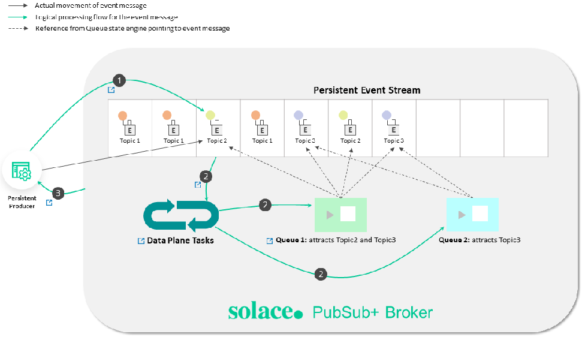
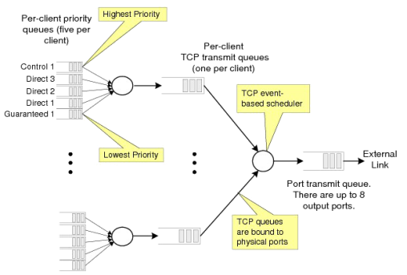
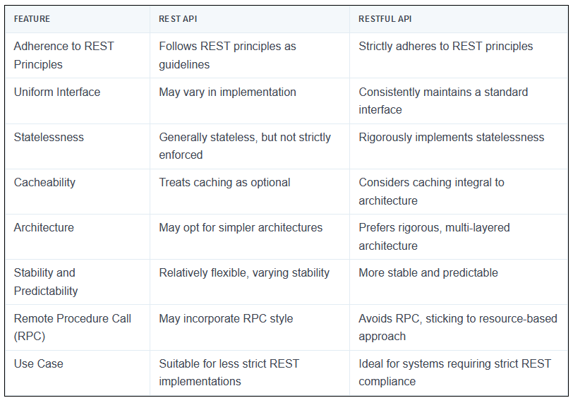
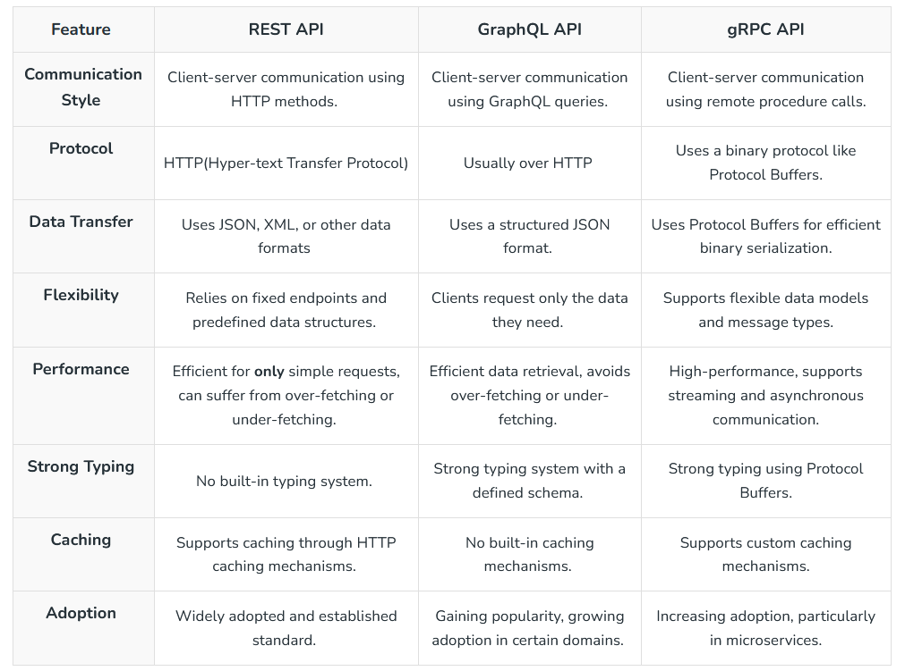

# Introductory 

Message brokers are crucial components in modern computing architectures, particularly in distributed systems and microservices-based applications. They facilitate communication between various applications, systems, and services by translating messages between different messaging protocols, allowing them to interact despite being written in different languages or running on different platforms. This functionality is achieved through a combination of mechanisms and patterns designed to ensure efficient, reliable, and secure message exchange.

# Products

# Messages
At its most basic, messaging involves the following participants [10]:

- [x] Publisher—the entity that sends or publishes a message (also called a **producer**)
- [x] Message—the information the publisher wants to send. **Messages often contain event data, but can also carry queries, commands, and other information**.
- [x] Messaging system—the infrastructure that transmits the message
- [x] Subscriber—the ultimate receiver of the message (also called a **consumer**)

In an event-driven architecture (EDA), a message typically has a destination that separates the publisher from the subscriber. In the **PubSub+ platform, a destination is generally a topic endpoint or a queue**. Topic endpoints and queues are managed by event brokers [10].
The following diagram illustrates event messages disseminating to multiple subscribers through a topic endpoint [10].

Following are some of the features of a good message passing System [19].

- [x] Simplicity
- [x] Uniform semantics
- [x] Efficiency
- [x] Reliability
- [x] Corrections
- [x] Flexibility
- [x] Security
- [x] Portability

## Message Types

The PubSub+ Platform supports three types of messages [10]:

- [x] **An event message** describes something that an application needs to tell other applications about. **An event stream is a series of event messages published as events occur.** Pricing streams and trade streams in capital markets are examples of event streams. Events and the messages that describe them are so closely tied together that we often use the terms event and message interchangeably in this documentation.
- [x] **A query** is a message that retrieves information (for example, using HTTP GET and HEAD methods). *A query requires a response.*
- [x] **A command** instructs another application to perform an action or change a state (for example, using HTTP POST, PUT, and DELETE methods). Commands, like queries, *require a response.*

## Message Structure

A message has three parts: Header, Properties, and Body, as shown in the following diagram [10].

Producers and consumers must agree upon the payload format so that the data can be properly interpreted. **Event messages use a schema to define the payload format [10].** 

## Message Delivery Modes

PubSub+ event brokers support the following types of message delivery [10]:

### Direct Messaging
Direct messaging has the following characteristics [10]:

- [x] Clients subscribe to topics directly.
- [x] Messages are not retained for a client when that client is not connected to an event broker or event broker service.
- [x] Messages can be discarded when congestion or system failures are encountered.
- [x] Messages are not acknowledged upon delivery.

### Guaranteed Messaging
Guaranteed messaging has the following characteristics [10]:

- [x] Topic subscriptions are associated with an endpoint on the broker rather than consuming clients.
- [x] Messages can't be lost once they are acknowledged by the event broker.
- [x] When messages are delivered to a durable endpoint, they are retained until they are consumed by a client.
- [x] Delivery to a client is acknowledged.

## Topics
As metadata in a message header that let publishers classify messages and let subscribers specify what they want to receive messages about. This publish-subscribe model enables event brokers to use topics as routing information to send event messages everywhere they need to go [10]. 

> For example: `flight/[status]/[flightNumber]/[origin]/[destination]`

- [x] flight indicates the **type of event**.
- [x] boarding indicates the **action** that generates the event.
- [x] ea1234/jfk/ord are **properties** of the specific event.
- [x] e.g., flightNumber would be wildcard `*`.

The `>` character is used at the last level of a subscription to indicate a “one or more” wildcard match. For example, *flight/boarding/>* doesn't match the topic *flight/boarding*, but it does match flight/boarding/ea1234 and flight/boarding/ea321/yow/fra [10].

### How Rich Topic Hierarchies Benefit an Event Mesh?

If the event brokers were configured as an event mesh, events sent to **any event broker in the mesh can be forwarded to other event brokers** in the mesh. **Dynamic Message Routing (DMR)** automatically determines the best way to route messages through your event mesh [10].
Smart topics and subscriptions serve various purposes within an event mesh and enable the following benefits when combined with a rich topic hierarchy [10]:

* Event Routing
    The event topic allows the event broker to make routing decisions without the need for complex understanding of the data encoded in the event's payload.
* Event Filtering
    Without this fine-grained filtering, consumers may need to discard some of the received data, or an intermediary process would need to re-publish the data to a more specific stream.
* Event Access Control
    you can precisely control the flow of data based on the description of the data in the topic. Lack of precise access control may enable rogue applications to consume privileged information or initiate restricted actions.
* Event Handling Policy
    With a rich topic hierarchy, administrators can ensure that the right messages are replicated, added to replay logs, etc.

## Message VPNs
Message VPNs allow for many **separate applications** to share a single Solace PubSub+ software or appliance event broker while still remaining independent and separated. Basically, Message VPNs enable the **virtualization of an event broker into many individual virtual event brokers** [10]. (We say `vhost` about using RabbitMQ)
Message VPNs allow for the **segregation of topic space and messaging space by creating fully separate messaging domains**. Message VPNs also group clients connecting to a network of Solace PubSub+ event brokers so that **messages published within a particular group are only visible to clients that belong to that group**. Each client connection is associated with a single Message VPN [10].

# Mechanisms

- **Message Queues**: At the heart of message brokers' operation is the concept of a message queue. Messages are stored in the queue in the order they arrive, ensuring they are processed **in sequence**. This mechanism **supports asynchronous processing**, preventing data loss, and allowing systems to continue functioning even if processes or connections fail. Message queues are either stored in **memory or on a hard disk**, depending on the requirements for durability and persistence [4].

- **Translation and Routing**: Message brokers translate messages from the **sender's protocol to the receiver's protocol**, ensuring interoperability. They also route messages to the appropriate destination based on predefined rules or patterns, facilitating the decoupling of senders and receivers [2].

- **Reliability and Delivery Guarantees**: To ensure message delivery, especially in scenarios where the receiver might not be online immediately, message brokers implement **mechanisms like acknowledgments and retransmissions**. This ensures that messages are not lost and are delivered once the receiver is ready to process them [4].

# Patterns

- **Point-to-Point Messaging**: In this model, **a producer sends a message directly to a single consumer**. This pattern is suitable for scenarios where a direct response is expected from the consumer after processing the message [5].

- **Publish-Subscribe Messaging**: Here, a message is published to a topic, and all subscribers to that topic receive the message. This pattern is ideal for **broadcasting messages** to multiple recipients simultaneously, supporting **scenarios like notifications or event-driven architectures** [5].

- **Request/Reply**

# Use Cases and Benefits

- **Microservices Communication**: In microservices architectures, message brokers enable seamless **communication between services**, allowing them to scale independently and deploy updates without impacting others. This is crucial for maintaining system stability and reliability [2].

- **Hybrid and Multicloud Environments**: Message brokers facilitate communication **between on-premises systems and cloud components**, as well as between different cloud platforms. This is essential for organizations transitioning to or operating in hybrid and multicloud environments [2].

- **Serverless Computing**: In serverless architectures, where **services run on-demand**, message brokers provide a *scalable and reliable* way to **trigger functions or services in response to events or messages** [2].

Despite their advantages, implementing message brokers introduces complexity and requires understanding various messaging models and patterns. Developers must navigate the learning curve associated with configuring and debugging message brokers to effectively leverage their capabilities in distributed systems [4].

# Durability

Qos of event messages, which can be classified as Persistent (Guaranteed) or Non-Persistent [10]:

## Persistent Event Streams

Messages flagged as Persistent result in an **acknowledgment message being sent back to the producer** after the message is stored.

## Non-Persistent Event Streams

These events provide a QoS for consumers where loss of messages is acceptable. 

# Data Plane Tasks

The following diagram illustrates the tasks performed by the Data Plane [10]:

*Topics that make it simple to configure a range of capabilities like queue routing, message promotion and demotion, and disaster recovery [10].*

The following discussion and links provide information about the components illustrated in the diagram [10]:

- [x] Consumer Egress Queue: Learn more about egress per-client priority queues on brokers, and the commands that you can use to configure them.
- [x] En/Ingress Topic ACL: You can use ACLs to control the topics to which clients are allowed to publish.
- [x] Promotion: Message promotion is the situation where a producer sends **Direct messages**, and the consumer **receives these message from a Guaranteed messaging endpoint**.
- [x] Demotion: Message demotion is the situation where the producer sends **Persistent messages**, and there are consumers that want to receive these messages, but can **tolerate lost messages.**
- [x] Prioritization: When you enable an endpoint to respect message priority, the priority field in messages from producers are respected for all **guaranteed and promoted direct messages.**
- [x] Shared Subscriptions: Shared subscriptions can be **used to load balance** large volumes of client data across multiple instances of back end data center applications.
- [x] Persistent Message moved to Persisted Event Stream: All messages from the TCP network are placed into the Non-Persistent Event Stream directly. Based on the Delivery Mode in the message set to Persistent, the message is moved and persisted against the Persistent Event Stream.
- [x] Logging: Learn how to use messaging APIs for logging.
- [x] Subscription Binding: Typically, messages are published to a Queue when it's set as the destination of the message. However, you can also add a topic subscription to a Queue so that it receives any messages that are published to a matching topic destination.

# Standards

## Protocols

### REST
The Solace REST Messaging API allows HTTP clients to send and receive messages with an event broker using HTTP POST requests. This enables REST clients to send messages to and receive messages from any Solace PubSub+ event broker clients without needing to use any Solace-provided API [10].

### AMQP 
Solace PubSub+ software event brokers support AMQP 1.0 as a component in Solaceʼs multi-protocol, any-to-any messaging solution based on open source and open standards.
AMQP 0-9-1 and AMQP 1.0 are both messaging protocols, but they are fundamentally different in several key aspects [10]:

- [x] Scope and Topology Model: AMQP 1.0 introduces a different scope and topology model compared to AMQP 0-9-1. While AMQP 0-9-1 focuses on binary messaging and is designed for microservices and enterprise messaging, **AMQP 1.0 aims to be more flexible and adaptable to various messaging scenarios, including cloud-based services and IoT devices** [12].
- [x] Compatibility and Conformance: AMQP 1.0 is considered a separate protocol from AMQP 0-9-1, and its support requires a plugin in systems like RabbitMQ. Despite being different protocols, both are supported by RabbitMQ, indicating that AMQP 1.0 is not intended as a direct replacement for AMQP 0-9-1 but as an alternative for specific use cases [13].
- [x] Adoption and Implementation: **The adoption of AMQP 1.0 has been limited** due to its complexity and the fact that it represents a significant change from AMQP 0-9-1. Many messaging systems, including RabbitMQ, continue to support AMQP 0-9-1 extensively and offer AMQP 1.0 as an optional feature. This approach reflects the practical considerations of migrating from one protocol to another, especially when the newer version does not offer clear advantages over the established one [11].

In summary, AMQP 0-9-1 and AMQP 1.0 differ significantly in their design philosophy, scope, and implementation details. AMQP 0-9-1 remains widely adopted for its simplicity and effectiveness in many messaging scenarios, while AMQP 1.0 offers greater flexibility at the cost of increased complexity and less widespread adoption [10].

### MQTT
Solace supports the OASIS MQTT 3.1.1 and MQTT 5.0 standards to meet the needs of connected devices and mobile applications that need an efficient way to send and receive information that **requires very little client-side processing power, memory and/or bandwidth**. The Solace PubSub+ event broker works with any third-party MQTT 3.1.1 or MQTT 5.0 compliant client API, including open source APIs available via an Eclipse initiative called Paho [10].

### Web Socket

The WebSocket protocol allows you to specify a subprotocol during the initial **HTTP/1.1** handshake that can be used on top of WebSockets (for example, MQTT). Alternatively, you can define your own protocol on top of raw WebSockets if, say, you need custom data semantics or **extra features such as publish/subscribe messaging** [16].
**As an event-driven technology**, WebSocket allows data to be transferred without the client requesting it [16].
As ws is **bidirectional streaming** so, you can use multiplexing with WebSocket to improve performance, but you must either use a third-party library or support it in your code. Both options add complexity to your project.

#### Features of WebSocket are [19]

- [x] Full-Duplex Protocol: WebSocket is a full-duplex protocol as it allows the application to send and receive data at the same time.
- [x] Stateful Protocol: It means the connection between server and client will not be terminated until and unless closed by any one of them either by the client or by the server. Once the connection is terminated from one end it is also closed by another end.
- [x] 3-way handshake: Websocket uses a 3-way handshake also known as TCP connection for establishing communication between a client and server.

### RPC
RPC is especially well suited for client-server (e.g. query-response) interaction in which the flow of control alternates between the caller and callee. Conceptually, the client and server do not both execute at the same time. Instead, the thread of execution jumps from the caller to the callee and then back again [19]. 

#### gRPC
**By default, gRPC uses Protocol Buffers (Protobuf) Interface Definition Language (IDL) to define the schema** [16].
gRPC uses **HTTP/2** as the transport protocol and Protobuf as the wire format [16].
gRPC supports **multiplexing** many requests on one connection, allowing for higher throughput [16].

##### gRPC-web
As you will recall from the introduction, gRPC relies on HTTP/2 under the hood[16].
Unfortunately, while modern web browsers do actually support HTTP/2, they don’t give client library developers the fine-grain control they need to implement the gRPC specification[16].
To work around this, **gRPC-web requires a small proxy on the server** to translate the requests and responses from HTTP/2 to HTTP/1 [16].

### GraphQL
GraphQL is a language for querying data. Unlike most query languages (such as SQL), you don’t use GraphQL to query a particular type of data store (such as a MySQL database). Instead, you use GraphQL to query data from various sources over HTTP [15].

## OpenAPIs

### Open API and Swagger
The OpenAPI Specification (OAS) defines a standard, language-agnostic interface to HTTP APIs [17].

### OpenMAMA
The Open Middleware Agnostic Messaging API (OpenMAMA) is an open source, lightweight, vendor-neutral integration layer for sending and receiving market data information supported by the Linux Foundation. With unified support for many different kinds of data distribution in a compact, cost-effective platform [10].
**OpenMama uses a common publish/subscribe idiom (pub/sub)**. In this messaging pattern the messages are not sent directly to the receivers, but published to a topic. Subscribers express interest in one or more topics, and receive only messages that interest them. This decoupling of publishers and subscribers allows for greater scalability [14].
**OpenMAMDA (Open Middleware Agnostic Market Data API) is a framework** running on top of OpenMAMA which provides a market data specific API abstracting quotes, trades, order books, option chains and more, and which provides significant functionality to simplify development of trading applications [14].

### JSM
The Java Message Service (JMS) API is a messaging standard that allows application components based on the J2E.
Open Message Queue (Open MQ) is both the Java Message Service reference implementation and a production-ready message queue.

### Apache Qpid
Messaging built on AMQP. Apache Qpid™ makes messaging tools that speak AMQP and support many languages and platforms. It provides transaction management, queuing, distribution, security, management, clustering, federation and heterogeneous multi-platform support.

### Eclipse Paho
MQTT and MQTT-SN are lightweight publish/subscribe messaging transports for TCP/IP and connectionless protocols (such as UDP) respectively. The Eclipse Paho project provides open source, mainly client side, implementations of MQTT and MQTT-SN in a variety of programming languages.

# Tools
## Solace

- [x] [Resource Calculator for PubSub+ Software Event Brokers](https://docs.solace.com/Admin-Ref/Resource-Calculator/pubsubplus-resource-calculator.html)
- [x] [Versus Kafka](https://solace.com/differences/kafka/)