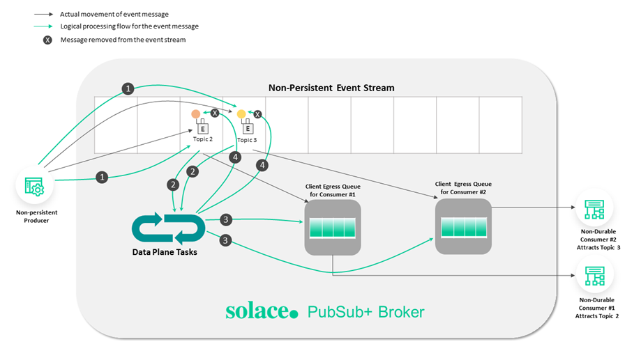

# Introductory 

Message brokers are crucial components in modern computing architectures, particularly in distributed systems and microservices-based applications. They facilitate communication between various applications, systems, and services by translating messages between different messaging protocols, allowing them to interact despite being written in different languages or running on different platforms. This functionality is achieved through a combination of mechanisms and patterns designed to ensure efficient, reliable, and secure message exchange.

# Messages
At its most basic, messaging involves the following participants [10]:

- [x] Publisher—the entity that sends or publishes a message (also called a **producer**)
- [x] Message—the information the publisher wants to send. **Messages often contain event data, but can also carry queries, commands, and other information**.
- [x] Messaging system—the infrastructure that transmits the message
- [x] Subscriber—the ultimate receiver of the message (also called a **consumer**)

In an event-driven architecture (EDA), a message typically has a destination that separates the publisher from the subscriber. In the **PubSub+ platform, a destination is generally a topic endpoint or a queue**. Topic endpoints and queues are managed by event brokers [10].
The following diagram illustrates event messages disseminating to multiple subscribers through a topic endpoint [10].

## Message Types

The PubSub+ Platform supports three types of messages [10]:

- [x] **An event message** describes something that an application needs to tell other applications about. **An event stream is a series of event messages published as events occur.** Pricing streams and trade streams in capital markets are examples of event streams. Events and the messages that describe them are so closely tied together that we often use the terms event and message interchangeably in this documentation.
- [x] **A query** is a message that retrieves information (for example, using HTTP GET and HEAD methods). *A query requires a response.*
- [x] **A command** instructs another application to perform an action or change a state (for example, using HTTP POST, PUT, and DELETE methods). Commands, like queries, *require a response.*

## Message Structure

A message has three parts: Header, Properties, and Body, as shown in the following diagram:

Producers and consumers must agree upon the payload format so that the data can be properly interpreted. **Event messages use a schema to define the payload format.** 

## Mechanisms

- **Message Queues**: At the heart of message brokers' operation is the concept of a message queue. Messages are stored in the queue in the order they arrive, ensuring they are processed **in sequence**. This mechanism **supports asynchronous processing**, preventing data loss, and allowing systems to continue functioning even if processes or connections fail. Message queues are either stored in **memory or on a hard disk**, depending on the requirements for durability and persistence [4].

- **Translation and Routing**: Message brokers translate messages from the **sender's protocol to the receiver's protocol**, ensuring interoperability. They also route messages to the appropriate destination based on predefined rules or patterns, facilitating the decoupling of senders and receivers [2].

- **Reliability and Delivery Guarantees**: To ensure message delivery, especially in scenarios where the receiver might not be online immediately, message brokers implement **mechanisms like acknowledgments and retransmissions**. This ensures that messages are not lost and are delivered once the receiver is ready to process them [4].

## Patterns

- **Point-to-Point Messaging**: In this model, **a producer sends a message directly to a single consumer**. This pattern is suitable for scenarios where a direct response is expected from the consumer after processing the message [5].

- **Publish-Subscribe Messaging**: Here, a message is published to a topic, and all subscribers to that topic receive the message. This pattern is ideal for **broadcasting messages** to multiple recipients simultaneously, supporting **scenarios like notifications or event-driven architectures** [5].

### Use Cases and Benefits:

- **Microservices Communication**: In microservices architectures, message brokers enable seamless **communication between services**, allowing them to scale independently and deploy updates without impacting others. This is crucial for maintaining system stability and reliability [2].

- **Hybrid and Multicloud Environments**: Message brokers facilitate communication **between on-premises systems and cloud components**, as well as between different cloud platforms. This is essential for organizations transitioning to or operating in hybrid and multicloud environments [2].

- **Serverless Computing**: In serverless architectures, where **services run on-demand**, message brokers provide a *scalable and reliable* way to **trigger functions or services in response to events or messages** [2].

Despite their advantages, implementing message brokers introduces complexity and requires understanding various messaging models and patterns. Developers must navigate the learning curve associated with configuring and debugging message brokers to effectively leverage their capabilities in distributed systems [4].

# Durability

Qos of event messages, which can be classified as Persistent (Guaranteed) or Non-Persistent.

## Persistent Event Streams

Messages flagged as Persistent result in an **acknowledgment message being sent back to the producer** after the message is stored. 

## Non-Persistent Event Streams

These events provide a QoS for consumers where loss of messages is acceptable

# Data Plane Tasks

The following diagram illustrates the tasks performed by the Data Plane:

## Tools

### Solace

- [x] [Resource Calculator for PubSub+ Software Event Brokers](https://docs.solace.com/Admin-Ref/Resource-Calculator/pubsubplus-resource-calculator.html)
- [x] [Versus Kafka](https://solace.com/differences/kafka/)