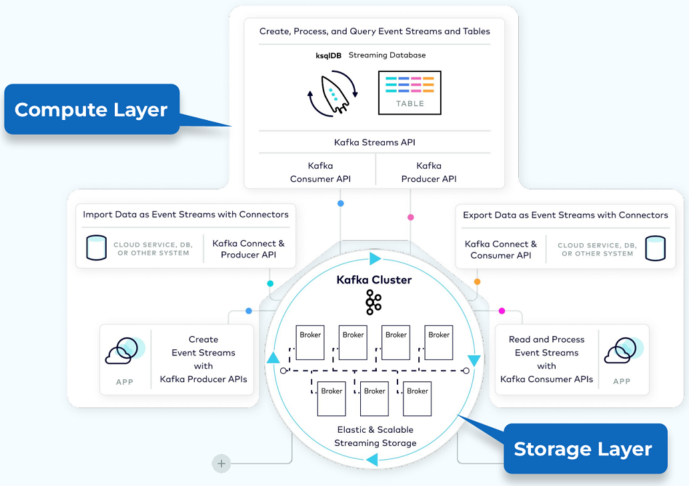
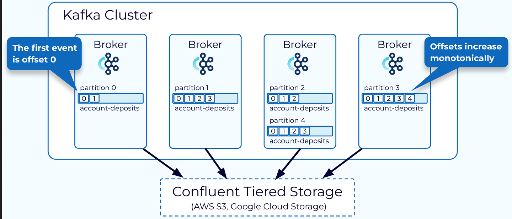
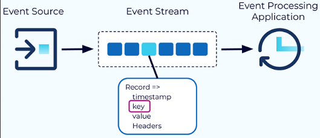
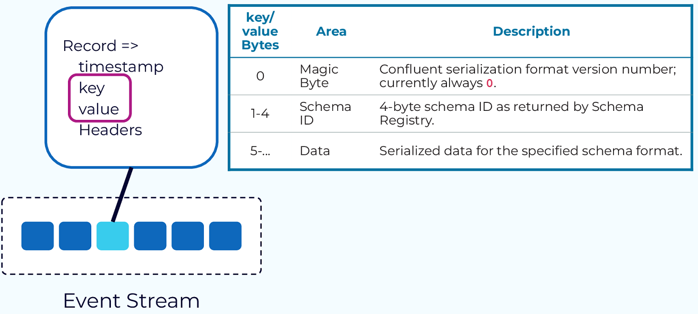
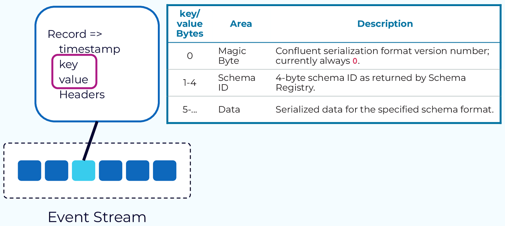

# Kafka

To quickly grasp the concepts and patterns of Kafka, focus on understanding its core components and how they interact within the system. Here's a condensed reference:

### Core Concepts

- **Event**: The fundamental unit of data in Kafka, representing something that happened (e.g., a purchase order, payment). *Each event is a record with a timestamp, key, value, and optional headers.* The key is crucial for ordering, colocation, and retention [20].
  
- **Topic**: *Organizes events* of the same type. Think of it as a database table. All events published to a topic are immutable and append-only. *Topics are divided into partitions for scalability and parallelism* [20].

- **Partition**: The unit of data distribution and parallelism. *Data for a partition is stored within a single broker*, allowing for independent and parallel access by producers and consumers. *Partitions enable Kafka's scalability and fault tolerance* [20].

- **Offset**: *A unique identifier for each event within a partition, ensuring events are stored and consumed in order. Offsets are monotonically increasing and never reused, facilitating consumer tracking* [20].

### Key Components

- **Producer API**: Allows publishing events to Kafka. Producers send *records to topics, specifying the topic and partition* [20].

- **Consumer API**: Enables reading events from Kafka. *Consumers subscribe to topics* and consume records from the specified partitions [20].

- **Streams API**: A higher-level API for building applications and microservices, where the input and output data are stored in Kafka clusters. It supports *complex event processing and stream querying* [20].

- **Connect API**: Integrates Kafka with other systems. Source connectors *import* data from external systems into Kafka, while sink connectors *export* data from Kafka to external systems [20].

- **Schema Registry**: Manages and stores Avro schemas. It provides a serving layer for your metadata. *It ensures that data produced is compatible with the schema defined in the registry* [20].

### Patterns and Architectures

- **Publish-Subscribe Model**: Commonly used pattern where producers publish messages to topics, and consumers subscribe to topics of interest. This *decouples message producers from consumers* [20].

- **Log Compaction**: Ensures that Kafka retains at least the last known value for each message key within a partition. This is useful for scenarios where you want to ensure that the *latest state is available even if older states are discarded* [20].

- **Exactly Once Semantics**: Kafka aims to *deliver messages exactly once to the consumer*. This is achieved through a combination of idempotent producers, atomic commits, and consumer offsets [20].

- **Scalability and Fault Tolerance**: Kafka's distributed nature allows it to scale horizontally by adding more brokers to the cluster. It also *provides fault tolerance through replication of data across multiple brokers* [20].

### Further Learning

